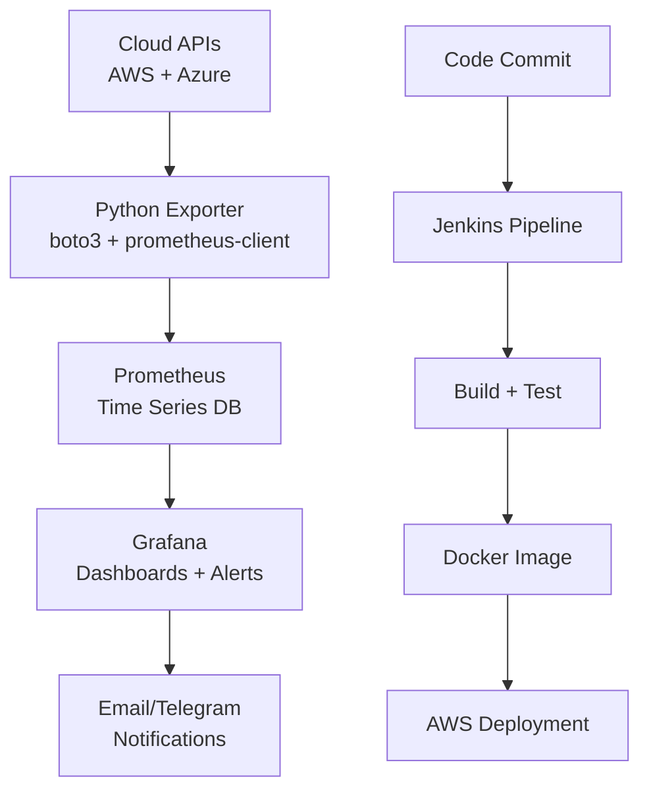

<h1 align="center">Hi there, I'm Utkrist Gupta 👋</h1>
<h3 align="center">Software Engineer | Python Backend | Cloud | AI & GenAI | DevOps</h3>

<p align="center">
  
</p>

<p align="center">
  
  
</p>

---

## 🚀 About Me
```python
class UtkristGupta:
    def __init__(self):
        self.role = "Software Engineer"
        self.focus = [
            "Backend Development",
            "Cloud & Distributed Systems",
            "AI & Generative AI",
            "Automation & DevOps"
        ]

        self.currently_building = [
            "AI-powered backend applications",
            "RAG & Agentic AI systems",
            "Cloud-native applications",
            "Scalable APIs and services"
        ]

        self.tech_stack = {
            "languages": ["Python", "Java", "JavaScript"],
            "backend": ["FastAPI", "REST APIs", "PostgreSQL"],
            "cloud": ["AWS", "Azure"],
            "devops": ["Docker", "Kubernetes", "Jenkins", "Git"],
            "ai": ["LangChain", "LangGraph", "RAG", "LLMs"],
            "observability": ["Prometheus", "Grafana"]
        }

        self.mindset = "Build scalable, reliable, and intelligent systems"

    def say_hi(self):
        print("Thanks for dropping by! Let's build something amazing together!")


me = UtkristGupta()
me.say_hi()
```

---

## 💻 Tech Stack

### ☁️ Cloud & Infrastructure


### 📊 Observability & Monitoring


### 🔄 CI/CD & Automation


### 🧠 AI & ML


### 🛠️ Languages & Frameworks


---

## 🔥 Featured Projects

### 🌩️ Multi-Cloud Cost Dashboard
> Real-time AWS + Azure cost monitoring with Prometheus & Grafana


- 🔗 Custom Python Prometheus exporter fetching real AWS Cost Explorer data
- 📊 6-panel Grafana dashboard — Stat, Time Series, Pie Chart visualizations
- 🔵 Azure costs simulated with realistic service-level data
- 🚨 CloudWatch billing alarms + Grafana alerting pipeline
- 🔐 IAM read-only security, `.env` credential management

**[View Project →](https://github.com/CloudFlamedev/multi-cloud-cost-dashboard)**

---

### 🏋️ IronIQ — AI Gym Tracker
> React workout tracking app with AI coach powered by Gemini 2.0 Flash


- 💪 Workout logging with SVG-based progress charts
- 🤖 AI coach using Google Gemini 2.0 Flash API (free tier)
- 📈 One-rep max estimation and performance tracking

---

## 🏗️ DevOps Architecture



---

## 🌱 Current Learning Path

```
Cloud Observability     ████████████░░  85%
Prometheus + PromQL     ████████████░░  80%
Grafana Dashboards      ███████████░░░  75%
AWS Services            ████████████░░  80%
LangChain / AI Agents   ██████████░░░░  70%
Kubernetes              ████████░░░░░░  55%
```

---

## 🎯 2026 Goals

- 🔭 Build an **AI-powered incident response bot** (Prometheus + LangChain)
- 📊 Deploy a **Kubernetes cluster monitoring** dashboard
- 🌐 Complete **AWS Solutions Architect** certification
- 💡 Contribute to open source observability tools
- 🚀 Build **CI/CD pipelines** with GitHub Actions + Docker

---

## 📊 GitHub Stats

<p align="center">
  
  
</p>

<p align="center">
  
</p>

---

## 🏆 GitHub Trophies
<p align="center">
  
</p>

---

## 📫 Connect With Me

<p align="center">
  <a href="https://www.linkedin.com/in/utkrist-gupta-291518218">
    
  </a>
  <a href="https://portfolio-webpage-bpje.vercel.app/">
    
  </a>
  <a href="mailto:utkristg@gmail.com">
    
  </a>
  <a href="https://x.com/x_flame8">
    
  </a>
</p>

---

## 💡 Quote of the Day
<p align="center">
  
</p>

---

<p align="center">
  <i>💬 "Obsessed with building observable, intelligent cloud systems — one dashboard at a time."</i>
</p>

<p align="center">
  
</p>
