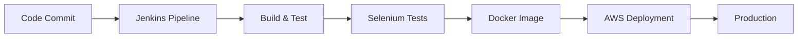

<h1 align="center">Hi there, I'm Utkrist Gupta 👋</h1>
<h3 align="center">Backend Developer | AI Integration Enthusiast | Cloud Solutions Architect</h3>

<p align="center">
  
</p>

<p align="center">
  
  
</p>

---

## 🚀 About Me
```python
class UtkristGupta:
    def __init__(self):
        self.role = "Backend Developer"
        self.focus = ["Agentic AI", "Cloud Solutions", "Scalable Systems"]
        self.currently_learning = ["LangChain", "LangGraph", "AI Integrations"]
        self.tech_stack = ["Java", "Python", "AWS", "Spring Boot"]
        self.devops_tools = ["Jenkins", "Selenium", "Docker"]
        self.mindset = "Building intelligent, scalable solutions with robust CI/CD"
    
    def say_hi(self):
        print("Thanks for dropping by! Let's build something amazing together!")

me = UtkristGupta()
me.say_hi()
```

Backend development specialist passionate about integrating AI into scalable cloud solutions. Currently exploring the intersection of traditional backend systems and cutting-edge AI technologies with a focus on automation and continuous delivery.

---

## 💻 Tech Stack

### Languages


### Frameworks & Libraries


### Cloud & DevOps


### AI & ML


### Testing & Automation


---

## 🔥 Current Focus

### 🤖 Working On
- 🦜 **LangChain/LangGraph Projects** - Building intelligent agent workflows
- 🔗 **Agentic AI Systems** - Exploring autonomous AI agent architectures
- 🐍 **Python AI Integrations** - Connecting AI capabilities with backend services
- 🔄 **CI/CD Pipelines** - Automating deployment workflows with Jenkins
- 🧪 **Test Automation** - Building robust test suites with Selenium

### 🌱 Learning Journey
- Advanced AWS services (Lambda, ECS, EventBridge)
- LangGraph for complex agent orchestration
- Retrieval-Augmented Generation (RAG) implementations
- Vector databases and semantic search
- Jenkins pipeline scripting and optimization
- Selenium WebDriver for end-to-end testing

### 🎯 Goals
- 🔭 Build scalable backend systems with AI capabilities
- 💡 Contribute to LangChain/AI open source projects
- 🌐 Deploy production-ready agentic AI applications
- 🚀 Implement robust CI/CD pipelines for automated testing and deployment
- 📚 Share knowledge through technical blogs and projects

---

## 🛠️ DevOps & Automation Workflow


---

## 📊 GitHub Stats

<p align="center">
  
  
</p>

<p align="center">
  
</p>

---

## 🏆 GitHub Trophies
<p align="center">
  
</p>

---

## 📌 Pinned Projects

### 🔗 Featured Work
- **[Portfolio-Webpage](https://github.com/CloudFlamedev/Portfolio-Webpage)** - Personal portfolio showcasing projects and skills
- **[Album.2525](https://github.com/CloudFlamedev/Album.2525)** - Full-stack album management application
- **[albumwebpage](https://github.com/CloudFlamedev/albumwebpage)** - Interactive web prototype

*🚧 More AI-powered projects with automated CI/CD coming soon!*

---

## 🔧 Skills Breakdown

<table>
  <tr>
    <td align="center" width="25%">
      
      <br>Java & Spring Boot
    </td>
    <td align="center" width="25%">
      
      <br>Python & AI
    </td>
    <td align="center" width="25%">
      
      <br>AWS Cloud
    </td>
    <td align="center" width="25%">
      
      <br>Jenkins CI/CD
    </td>
  </tr>
  <tr>
    <td align="center" width="25%">
      
      <br>Selenium Testing
    </td>
    <td align="center" width="25%">
      
      <br>Docker
    </td>
    <td align="center" width="25%">
      
      <br>LangChain
    </td>
    <td align="center" width="25%">
      
      <br>Git & GitHub
    </td>
  </tr>
</table>

---

## 📫 Connect With Me

<p align="center">
  <a href="https://www.linkedin.com/in/utkrist-gupta-291518218">
    
  </a>
  <a href="https://portfolio-webpage-bpje.vercel.app/">
    
  </a>
  <a href="mailto:your-email@example.com">
    
  </a>
  <a href="https://x.com/x_flame8">
    
  </a>
</p>

---

## 💡 Quote of the Day
<p align="center">
  
</p>

---

<p align="center">
  <i>💬 "Building the future with AI-powered systems, automated pipelines, and robust testing. Open to collaborating on innovative projects!"</i>
</p>

<p align="center">
  
</p>
