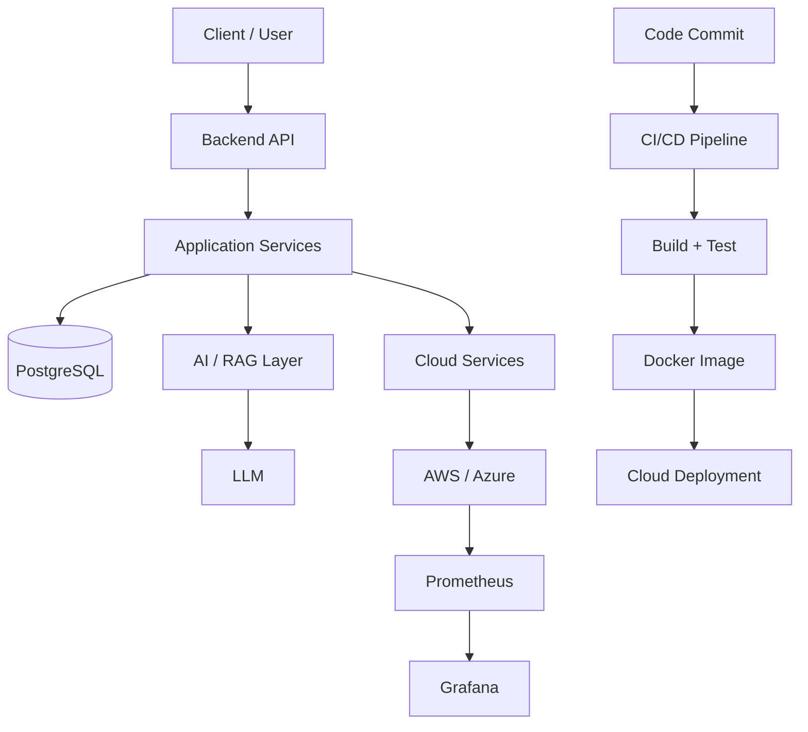

<h1 align="center">Hi there, I'm Utkrist Gupta 👋</h1>
<h3 align="center">Software Engineer | Python | Backend | Cloud | AI | DevOps</h3>

<p align="center">
  
</p>

<p align="center">
  
  
</p>

---

## 🚀 About Me

```python
class UtkristGupta:
    def __init__(self):
        self.role = "Software Engineer"

        self.focus = [
            "Backend Development",
            "Cloud & Distributed Systems",
            "AI & Generative AI",
            "DevOps & Automation"
        ]

        self.currently_building = [
            "Scalable backend applications",
            "RAG & Agentic AI systems",
            "Cloud-native applications",
            "Developer automation tools"
        ]

        self.tech_stack = {
            "languages": ["Python", "Java", "JavaScript"],
            "backend": ["FastAPI", "REST APIs", "PostgreSQL"],
            "cloud": ["AWS", "Azure"],
            "devops": ["Docker", "Kubernetes", "Jenkins", "GitHub Actions"],
            "ai": ["LangChain", "LangGraph", "RAG", "LLMs"],
            "observability": ["Prometheus", "Grafana"]
        }

        self.mindset = "Build scalable, reliable, and intelligent systems"

    def say_hi(self):
        print("Thanks for dropping by! Let's build something amazing together!")


me = UtkristGupta()
me.say_hi()
```

---

## 💻 Tech Stack

### 🐍 Languages & Backend


### 🧠 AI & Generative AI


### ☁️ Cloud


### ⚙️ DevOps & Automation


### 📊 Observability


---

## 🔥 Featured Projects

### 🤖 AI-Powered Incident Response

> Intelligent incident analysis and response using Python, observability data, RAG, and LLM-powered workflows.

**Focus:** Python • FastAPI • RAG • LLMs • LangChain • LangGraph • Prometheus

- 🔍 Analyze application and infrastructure alerts
- 🧠 Retrieve relevant incident and troubleshooting knowledge
- 🤖 Generate AI-assisted incident analysis and recommendations
- 📊 Integrate observability data into an intelligent workflow
- ⚙️ Automate repetitive incident-response tasks

---

### 🌩️ Multi-Cloud Cost Dashboard

> Real-time AWS + Azure cost monitoring with Prometheus and Grafana.


- 🔗 Custom Python Prometheus exporter fetching AWS Cost Explorer data
- 📊 Grafana dashboards for cloud cost visualization
- 🔵 Azure costs represented with service-level data
- 🚨 CloudWatch billing alarms and Grafana alerting
- 🔐 IAM read-only access and environment-based credential management

**[View Project →](https://github.com/CloudFlamedev/multi-cloud-cost-dashboard)**

---

### 🏋️ IronIQ — AI Gym Tracker

> React-based workout tracking application with an AI coach powered by Google Gemini.


- 💪 Workout logging and progress tracking
- 🤖 AI-powered workout coaching
- 📈 One-rep max estimation and performance analysis
- 📊 SVG-based progress visualizations

---

## 🏗️ System Architecture



---

## 🌱 Currently Learning

- 🏗️ System Design & Distributed Systems
- 🐍 Advanced Python Backend Development
- ⚡ FastAPI & Backend Architecture
- 🧠 RAG & Agentic AI
- ☁️ AWS & Cloud Architecture
- ☸️ Kubernetes & Cloud-Native Systems
- ⚙️ CI/CD & Infrastructure Automation

---

## 🎯 2026 Goals

- 🚀 Build production-grade Python backend applications
- 🧠 Build practical RAG and Agentic AI applications
- ☁️ Strengthen AWS and cloud architecture skills
- 🏗️ Improve scalable system design knowledge
- ⚙️ Build reliable CI/CD and cloud-native systems
- 🌱 Contribute to open-source projects
- 📚 Continue growing across backend, cloud, and AI engineering

---

## 📊 GitHub Activity

<p align="center">
  <a href="https://github.com/CloudFlamedev">
    
  </a>
</p>

---

## 📫 Connect With Me

<p align="center">
  <a href="https://www.linkedin.com/in/utkrist-gupta-291518218">
    
  </a>
  <a href="https://portfolio-webpage-bpje.vercel.app/">
    
  </a>
  <a href="mailto:utkristg@gmail.com">
    
  </a>
  <a href="https://x.com/x_flame8">
    
  </a>
</p>

---

<p align="center">
  <i>💡 Building scalable software, cloud-native systems, and intelligent applications.</i>
</p>

<p align="center">
  
</p>
